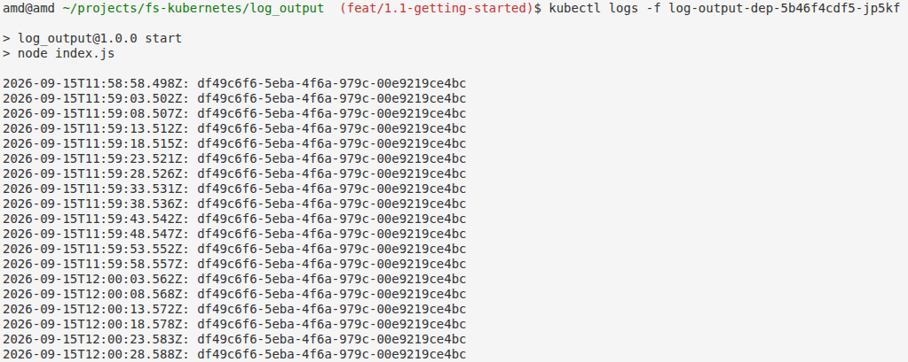
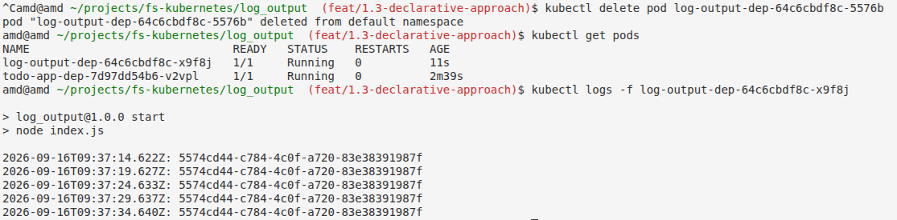
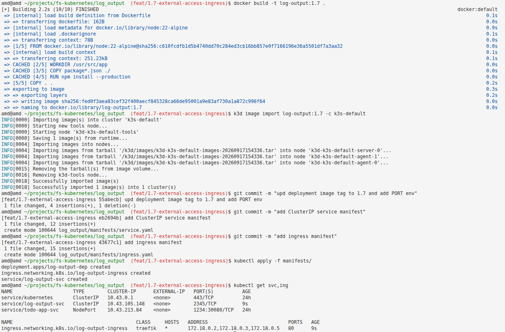
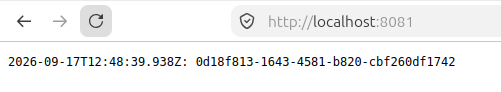

# Log Output

Generates a random UUID on startup and logs it with a timestamp every 5 seconds.

## Setup

### Run Locally

```bash
npm install
npm start
```

### Run with Docker

```bash
docker build -t log-output:1.1 .
docker run log-output:1.1
```

## Outputs

### #1.1

**Deploy to Kubernetes (k3d)**

```bash
# List available k3d clusters
k3d cluster list

# Import the Docker image into the k3d cluster
k3d image import log-output:1.1 -c <cluster-name>

# Create a Kubernetes deployment
kubectl create deployment log-output-dep --image=log-output:1.1

# Check running pods
kubectl get pods

# Follow pod logs
kubectl logs -f <pod-name>
```

#### Result



### #1.3

**Deploy to Kubernetes (declarative)**

With the **imperative** approach, you run direct commands (e.g. `kubectl create deployment`) that tell Kubernetes exactly what to do at a given moment, but this state exists only in the cluster's memory and is hard to reproduce or track over time. With the **declarative** approach, you describe the desired end state in a YAML file (e.g. `deployment.yaml`) and apply it with `kubectl apply -f`, letting the Deployment controller handle how to reach and maintain that state. This makes the configuration reproducible, version-controlled with git, and self-healing — if a pod is deleted, the controller automatically recreates it to match the desired state.

> **Note:** `kubectl delete` is an anti-pattern. Prefer updating the image tag in the YAML and re-running `kubectl apply` — Kubernetes will perform a rolling update with no downtime. `delete` was only used once here, to switch from the old imperative deployment to the new declarative one.

```bash
kubectl apply -f manifests/deployment.yaml
```

#### Result



This confirms that the declarative deployment.yaml file automatically restores the pod after deletion (the Deployment controller watches the desired state and immediately creates a replacement) — this is proof that the switch to the declarative approach was successful.

### #1.7

**Request flow:**

```
http://localhost:8081/
         ↓
  [Ingress Controller] (port 8081 mapped from host)
         ↓
  [Ingress Rules] (path: / → log-output-svc:2345)
         ↓
  [Service] (port 2345 → targetPort 3000)
         ↓
  [Pod] (container listening on port 3000)
         ↓
  [Application]
```

**Terminal:**



**Browser:**


