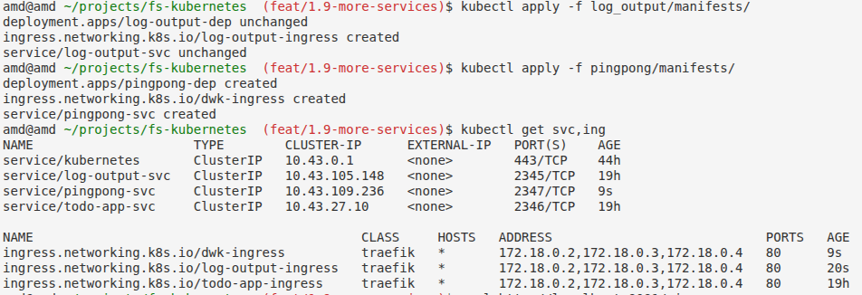

# Pingpong

Simple HTTP server that responds with "pong N" on GET /pingpong, where N is an in-memory counter that increases with every request.

## Setup

### Run Locally

```bash
npm install
npm start
```

### Run with Docker

```bash
docker build -t pingpong:1.9 .
docker run -p 3000:3000 pingpong:1.9
```

### Deploy to Kubernetes (k3d)

```bash
# Import the Docker image into the k3d cluster
k3d image import pingpong:1.9 -c k3s-default

# Apply the deployment and service
kubectl apply -f manifests/

# Check running pods
kubectl get pods
```
## Outputs

### #1.9

Since the task explicitly says to "share ingress with Log output application", this is one Ingress resource with two paths, not two separate ones. Kept it in log_output/manifests/ingress.yaml (where it already lived in 1.7, and had to be restored after being deleted in 1.8). Renamed it from log-output-ingress to dwk-ingress — it's no longer "log_output's Ingress" but a shared Ingress for the whole project. Plan to fold todo_app (1.8) into this same resource too, once I get to the exercises where everything runs side by side. In the browser: http://localhost:8081/pingpong — each page refresh increases the counter.

**Note:** since the task says to "share ingress with Log output application", this is one Ingress resource with two paths, not two separate ones. Kept it in `log_output/manifests/ingress.yaml` (where it already lived in 1.7, and had to be restored after being deleted in 1.8). Renamed it from `log-output-ingress` to `dwk-ingress` — it's no longer "log_output's Ingress" but a shared Ingress for the whole project. Plan to fold `todo_app` (1.8) into this same resource too, once everything runs side by side.

#### Result

Terminal:




In the browser: `http://localhost:8081/pingpong` — each page refresh increases the counter.

