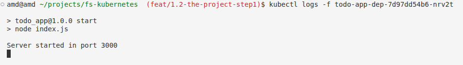
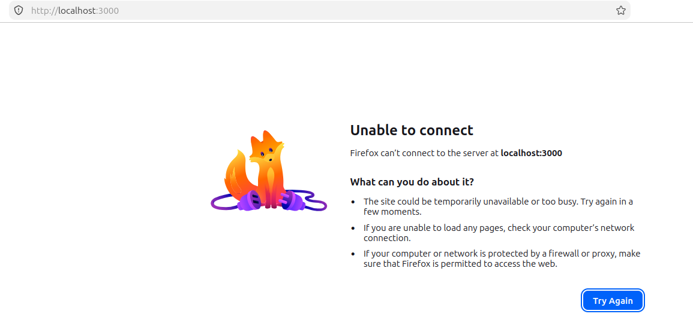
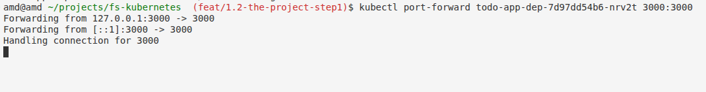
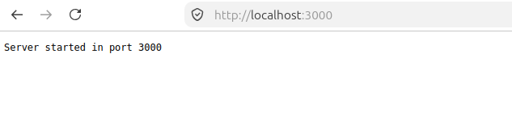
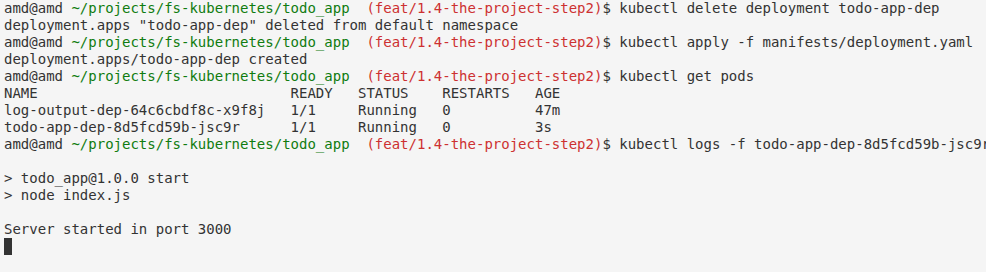
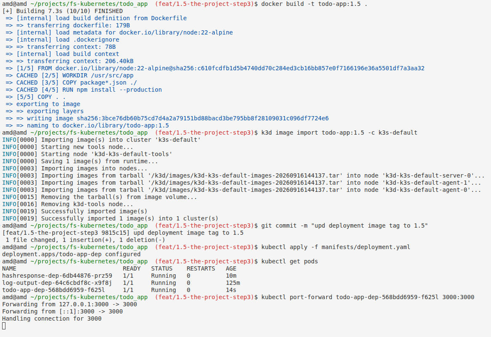
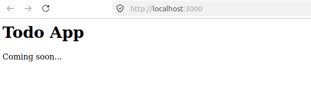
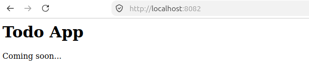

# Todo App

A simple web server that starts and logs "Server started in port NNNN". The port is configurable via the `PORT` environment variable. This application will evolve into a full todo application in later exercises.

## Setup

### Run Locally

```bash
npm install
PORT=3000 npm start
```

### Run with Docker

```bash
docker build -t todo-app:1.2 .
docker run -e PORT=3000 -p 3000:3000 todo-app:1.2
```

## Outputs

### #1.2

**Deploy to Kubernetes (k3d)**

```bash
# List available k3d clusters
k3d cluster list

# Import the Docker image into the k3d cluster
k3d image import todo-app:1.2 -c k3s-default

# Create a Kubernetes deployment
kubectl create deployment todo-app-dep --image=todo-app:1.2

# Check running pods
kubectl get pods

# Follow pod logs
kubectl logs -f <pod-name>
```

**View in Browser (local testing only)**

There is no external access configured for this exercise yet (networking is covered in a later part). To check the app in a browser for testing purposes, use port-forwarding:

```bash
kubectl port-forward <pod-name> 3000:3000
```

Then open `http://localhost:3000/` in your browser.

#### Result

Terminal output (`kubectl logs`):



In browser **NOT** working (as expected):



Browser output (via **port-forward**):





### #1.4

**Deploy to Kubernetes (declarative)**

With the **imperative** approach, you run direct commands (e.g. `kubectl create deployment`) that tell Kubernetes exactly what to do at a given moment, but this state exists only in the cluster's memory and is hard to reproduce or track over time. With the **declarative** approach, you describe the desired end state in a YAML file (e.g. `deployment.yaml`) and apply it with `kubectl apply -f`, letting the Deployment controller handle how to reach and maintain that state. This makes the configuration reproducible, version-controlled with git, and self-healing — if a pod is deleted, the controller automatically recreates it to match the desired state.

> **Note:** `kubectl delete` is an anti-pattern. Prefer updating the image tag in the YAML and re-running `kubectl apply` — Kubernetes will perform a rolling update with no downtime. `delete` was only used once here, to switch from the old imperative deployment to the new declarative one.

```bash
kubectl apply -f manifests/deployment.yaml
```

#### Result



This confirms that the declarative deployment.yaml file automatically restores the pod after deletion (the Deployment controller watches the desired state and immediately creates a replacement) — this is proof that the switch to the declarative approach was successful.

### #1.5

#### Result

Terminal output:



Browser output (via **port-forward**):



### #1.6

Before external access via a Service will work, there's one important prerequisite: our current cluster (created with k3d cluster create -a 2) has no ports exposed to the host — even with a NodePort Service, it still won't be reachable from the host machine, because the agent/loadbalancer ports simply aren't mapped from Docker to your computer. So we first recreate the cluster with explicitly exposed ports, and only then create the first Service resource, which tells Kubernetes how to route external traffic to your pod.

**Create a local Kubernetes cluster with k3d, with ports exposed to the host:**

```bash
k3d cluster create --port 8082:30080@agent:0 -p 8081:80@loadbalancer --agents 2
```

Needed for NodePort/Ingress access later. Two ports are mapped:
 
- `8081` (host) → `80` (loadbalancer, all server nodes)
- `8082` (host) → `30080` (a specific agent node, for NodePort)

```bash
kubectl cluster-info
kubectl get nodes
```

**Note:** recreating the cluster wipes any previously imported local images — re-import them and redeploy:

```bash
k3d image import todo-app:1.5 -c k3s-default

kubectl apply -f todo_app/manifests/deployment.yaml
```

**Create the NodePort Service:**

```bash
kubectl apply -f manifests/service.yaml
```

#### Result

Browser output (via **port-forward**):

